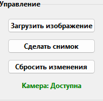
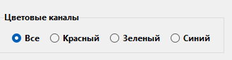
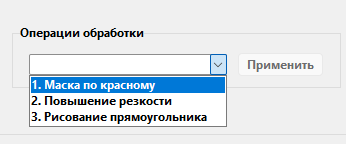

# OznakomitelnayaPractice - Приложение для обработки изображений

Приложение с графическим интерфейсом для базовой обработки изображений, разработанное на Python с использованием OpenCV и Tkinter.

##  Функционал

-  Загрузка изображений (JPG, PNG)
-  Захват фото с веб-камеры
-  Выделение цветовых каналов (RGB)
-  Маска по красному цвету
-  Повышение резкости изображения
-  Рисование прямоугольников
##  Установка
1. Скачайте Python версии 3.8 с сайта, указав добавление Python 3.8 в PATH
при установке.
```download
Скачайте последнюю версию с официального сайта: 
https://www.python.org/downloads/release/python-380/
Выберите "Windows x86-64 executable installer" в самом низу страницы
```
2. Скачайте мой проект в GitHub
```download
https://github.com/EgorProx/OznakomitelnayaPractice
Code -> Download ZIP
```
3. Благодаря последовательному выполнению трех команд, реализуйте
мой проект на вашем компьютере, предварительно зайдя в папку с приложением
app.py и введя "cmd" в поле пути папки.
Команды:
```bash
py -3.8 -m pip install --upgrade pip
```                       
```bash
py -3.8 -m pip install -r requirements.txt
```
```bash
py -3.8 app.py
```
## Структура проекта

## 📂 Структура проекта
```
OznakomitelnayaPractice/
├── app.py               # Основной код приложения
├── requirements.txt     # Зависимости
├── README.md            # Документация
└── .gitignore           # Гитигнор
```

## Инструкция по использованию
1. Запустите приложение.

2. При запуске вы можете увидеть в верхнем левом углу две
важные команды: "Загрузить изображение" и "Сделать снимок".

3. Для работы со снимком, вам нужна камера - подключите ее и нажмите на кнопку "Сделать снимок" -
через несколько секунд появится изображение.
4. Для работы с уже имеющимся изображением, нажмите на кнопку "Загрузить изображение".
5. Приступаем к функционалу приложения(можно выбрать любой цветовой канал, нужный вам)

6. Дальше, есть еще три функции:
7. Маска по красному - выделяет части изображения, которые имеют интенсивность по красному цвету выше, чем заданная вами.
8. Повышение резкости - повышает резкость изображения.
9. Рисование прямоугольника - вводится 4 координаты, и рисуется прямоугольник по заданным пиксельным координатам
## Удачного пользования!